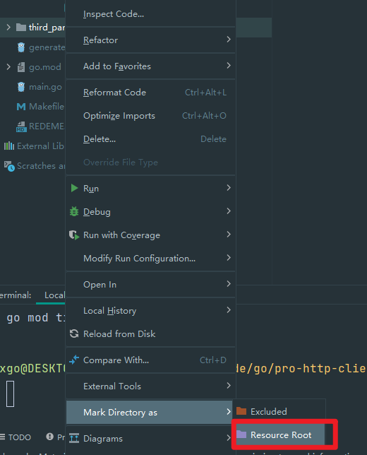

# 如何用go来开发Protobuf


## 初化始
> 安装相关的插件或工具
```bash
    make init
```

## 通过proto文件生成代码
```bash
   make generate #根目录要用generate.go
   #或者
   make validate #Makefile 要修改相对应的proto文件的位置
```

## ide 支持Protobuf
### 添加Protobuf组件

### 让IDE红线去掉报错信息



## protobuf 规范

https://go-kratos.dev/docs/guide/api-protobuf/

## windows 安装make
http://gnuwin32.sourceforge.net/packages/make.htm

http://gnuwin32.sourceforge.net/packages/libintl.htm


将它们下载，配置好环境变量可以使用make命令了

